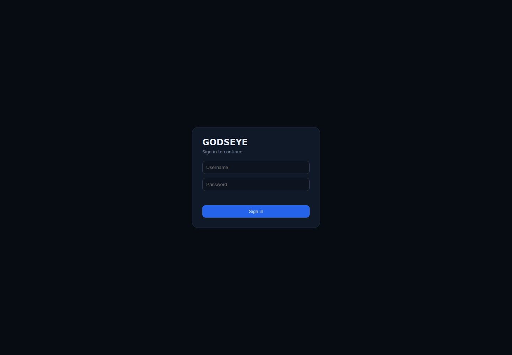
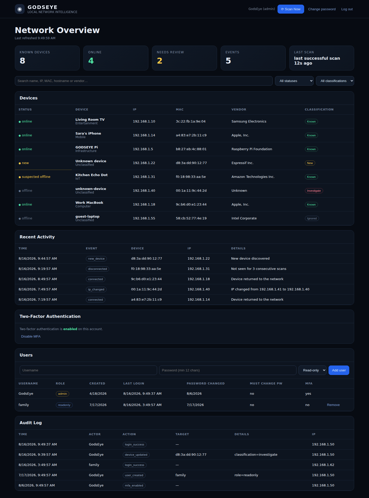
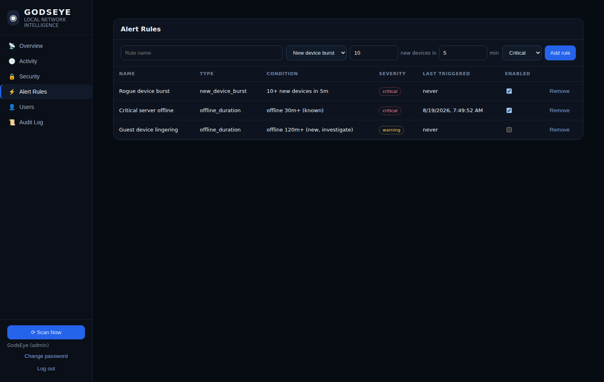
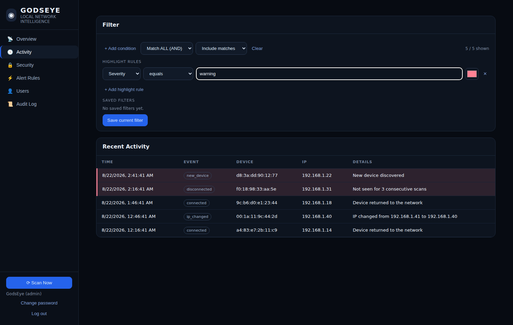
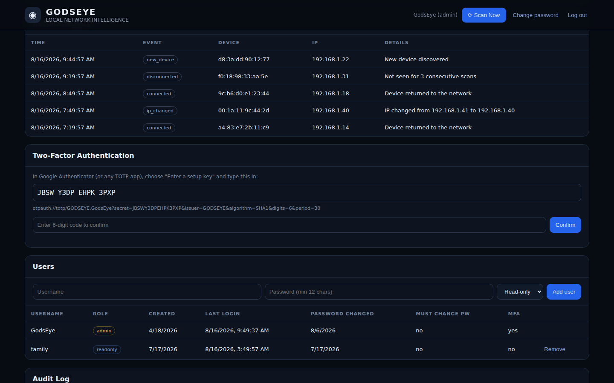

# GODSEYE

**GODSEYE** is a lightweight, local-first Raspberry Pi 4 network intelligence and monitoring appliance inspired by Pi.Alert.

## Current release: 0.14

- Opt-in DHCP lease file parsing (dnsmasq format) for hostname enrichment — takes priority over reverse DNS when both are available
- Optional Prometheus-compatible `/metrics` endpoint (device/event/user/rule counts, scanner health) — off by default, requires a bearer token to enable
- EventLogExpert-inspired filtering on the Activity and Audit Log views — AND/OR conditions, include/exclude mode, color highlight rules, and a personal saved Filter Library per user
- Left sidebar navigation (Pi-Alert style) — Overview, Activity, Security, Alert Rules, Users, and Audit Log as separate views instead of one long scrolling page; collapses to a horizontally-scrollable top bar on mobile
- Automatic ARP LAN discovery with `arp-scan`, plus reverse-DNS hostname lookup and an ICMP ping cross-check to reduce false offline events
- Alert rule engine — new-device burst detection and classification-aware offline-duration escalation, on top of the existing webhook/ntfy/email channels
- Persistent SQLite inventory
- New-device, disconnect, reconnect and IP-change events, tagged with severity
- Three-state device lifecycle (online / suspected offline / offline) that tolerates a missed scan or two before flagging a device gone
- Device classification (new / known / ignored / investigate) instead of a blunt trusted flag
- Outbound alerting: generic webhook (PSA/ticketing, Power Automate, Slack, Teams, etc.), ntfy, and email, with per-scan storm protection
- Session-based authentication with admin and read-only roles; grace-period password change (default 2 days) for admin-set passwords instead of an immediate hard block
- Two-factor authentication (TOTP - Google Authenticator, Authy, 1Password, etc.) with one-time backup codes
- Account lockout after repeated failed logins, idle session timeout, CSRF protection, security headers
- Optional password rotation (30/90/180 days) and password history/reuse prevention
- Admin-viewable audit log of logins, password changes, and administrative actions
- TLS via Caddy reverse proxy (auto-installed by `install.sh`, never blocks core app startup if it fails) and a randomly generated admin password at install time — no fixed default credentials shipped
- Device names, type and notes
- Search, status and classification filtering
- Activity history
- Scanner health heartbeat, surfaced on the dashboard if scans go stale
- Mobile-friendly dark dashboard
- Manual scan requests (admin only)
- Privilege separation: scanner is isolated from the web application
- systemd services for automatic startup/restart

## Screenshots

<p>
  <br>
  <em>Login</em>
</p>
<p>
  <br>
  <em>Overview - left sidebar navigation (Pi-Alert style) with Devices, Activity, Security, Alert Rules, Users, and Audit Log as separate views</em>
</p>
<p>
  <br>
  <em>Alert Rules - configure new-device-burst and offline-duration rules</em>
</p>
<p>
  <br>
  <em>Activity - AND/OR condition filtering, include/exclude mode, and color highlight rules (EventLogExpert-inspired)</em>
</p>
<p>
  <br>
  <em>Two-factor setup - scan or enter the key into Google Authenticator or any TOTP app</em>
</p>

These are real renders of the actual dashboard HTML/CSS/JavaScript shipped
in `app/main.py`, served against realistic sample data rather than a live
Raspberry Pi deployment - useful for seeing what the UI looks like without
having hardware to hand. If you'd like to swap these for screenshots of
your own running instance, they're easy to regenerate: run GODSEYE, log
in, and capture the browser window.

## Architecture

The web application runs as the unprivileged `godseye` user. Only `godseye-scanner.service` runs as root because `arp-scan` needs elevated network privileges. Both services share the SQLite database through the `godseye` group.

## Raspberry Pi installation

```bash
sudo apt update
sudo apt install -y git
sudo git clone https://github.com/msapgroup/SMARTTHINGS.git /opt/godseye-src
cd /opt/godseye-src
sudo bash install.sh
```

The installer installs the application under `/opt/godseye` and creates two services:

```bash
sudo systemctl status godseye-web
sudo systemctl status godseye-scanner
```

Then open `http://<raspberry-pi-ip>:8080` from a device on your LAN.

## Authentication

`install.sh` generates a random admin password at install time and
prints it once — there's no fixed, well-known default shipped in the
code at all as of 0.7. The generated credentials are saved to
`/etc/godseye.env` (root-only, `chmod 600`) in case you need them again.

- Username: `GodsEye` (override with `GODSEYE_ADMIN_USER`)
- Password: randomly generated, printed once at install — or set
  `GODSEYE_ADMIN_PASSWORD` yourself before running `install.sh` (e.g. as
  a hard step in a client-provisioning template) to skip the random one

**Password changes an admin sets on your behalf** — the initial seeded
password, a new account an admin creates for you, or a password an admin
resets — come with a **grace period** (`GODSEYE_PASSWORD_CHANGE_GRACE_DAYS`,
default 2 days) rather than an immediate hard block. You can log in and
use the app normally right away; a dismissible banner reminds you to set
your own password, and it's only actually *enforced* — blocking
everything except the change-password screen — once the deadline passes
without you changing it. Set `GODSEYE_PASSWORD_CHANGE_GRACE_DAYS=0` to go
back to the stricter immediate-block behavior.

If you're running the app directly in development rather than through
`install.sh` (`python3 -m app` with no env file), the same env vars still
work the same way, but nothing generates a random password for you in
that path — set `GODSEYE_ADMIN_PASSWORD` yourself, or expect the fallback
default of `GodsEye`/`GodsEye`.

Once logged in as an admin, add additional accounts from the **Users**
panel on the dashboard, or via the API:

```bash
curl -X POST https://<pi-ip>:8443/api/v1/users \
  -H "Content-Type: application/json" \
  -H "X-CSRF-Token: <value of the godseye_csrf cookie>" \
  --cookie "godseye_session=<your session cookie>" \
  -d '{"username":"family","password":"a-strong-password","role":"readonly"}'
```

Roles:
- **admin** — full access: view everything, change device classification, trigger scans, manage users
- **readonly** — can view devices, events, and health, but cannot change anything

### Two-factor authentication

Any account (admin or read-only) can enable TOTP-based two-factor
authentication from the **Two-Factor Authentication** panel on the
dashboard: scan the setup key into Google Authenticator, Authy,
1Password, or any standard TOTP app, confirm with a code, and save the
10 one-time backup codes shown afterward (each works once, for when the
device with your authenticator app isn't available). Once enabled, login
requires the password *and* a current code.

If a device with an enrolled authenticator is lost, an admin can reset
MFA for that account from the Users panel — this turns MFA off so the
user can re-enroll; nobody but the account holder can turn it back on,
since that requires access to their own authenticator app.

MFA is implemented with the standard TOTP algorithm (RFC 6238) using only
the Python standard library — no external dependency, no cloud service.

## Configuration

Set these as `Environment=` lines in the systemd unit files (or export them before running `python -m app` / `python -m app.scanner` in development). All are optional; defaults are shown.

| Variable | Default | Applies to | Purpose |
| --- | --- | --- | --- |
| `GODSEYE_DB` | `<app dir>/data/godseye.db` | both | SQLite database path |
| `GODSEYE_SCAN_INTERVAL` | `60` | scanner | Seconds between scan cycles |
| `GODSEYE_SUSPECTED_THRESHOLD` | `1` | scanner | Consecutive missed scans before a device is marked suspected offline |
| `GODSEYE_OFFLINE_THRESHOLD` | `3` | scanner | Consecutive missed scans before a device is marked offline and a disconnect event is logged |
| `GODSEYE_HEARTBEAT_STALE_AFTER` | `180` | web | Seconds since the scanner's last successful run before the dashboard reports it unhealthy |
| `GODSEYE_ADMIN_USER` | `GodsEye` | web | Username seeded for the first admin account (only used when the `users` table is empty) |
| `GODSEYE_ADMIN_PASSWORD` | `GodsEye` (dev) / randomly generated (via `install.sh`) | web | Password seeded for the first admin account |
| `GODSEYE_PASSWORD_CHANGE_GRACE_DAYS` | `2` | web | Days before an admin-set password (initial seed, new account, admin reset) is actually *enforced* — the account works normally with a reminder banner until then. `0` = enforce immediately |
| `GODSEYE_SESSION_TTL` | `604800` (7 days) | web | Absolute session lifetime in seconds |
| `GODSEYE_IDLE_TIMEOUT` | `900` (15 min) | web | Session is invalidated after this many seconds of inactivity, independent of the absolute TTL |
| `GODSEYE_MAX_FAILED_ATTEMPTS` | `5` | web | Failed logins before an account is temporarily locked |
| `GODSEYE_LOCKOUT_SECONDS` | `900` (15 min) | web | How long an account stays locked after too many failed attempts |
| `GODSEYE_MIN_PASSWORD_LENGTH` | `12` | web | Minimum password length (NIST 800-63B requires ≥8; longer is encouraged over composition rules) |
| `GODSEYE_PASSWORD_MAX_AGE_DAYS` | `0` (disabled) | web | Force a password change after N days — see the note below before enabling |
| `GODSEYE_PASSWORD_HISTORY_COUNT` | `5` | web | How many previous passwords are remembered and blocked from reuse |
| `GODSEYE_COOKIE_SECURE` | `false` | web | Marks cookies `Secure` — **only set this `true` if you will *exclusively* access GODSEYE over HTTPS.** Browsers silently refuse to send `Secure` cookies over plain HTTP, so enabling this breaks login on the plain `:8080` URL. `install.sh` does *not* set this automatically, precisely because it also gives you that plain HTTP URL as a valid access path. |
| `GODSEYE_LOGIN_BANNER` | *(empty)* | web | Optional text shown above the login form (e.g. an organizational consent/warning banner) |
| `GODSEYE_WEBHOOK_URL` | *(empty, disabled)* | scanner | Generic outbound webhook — POSTs a JSON event payload here |
| `GODSEYE_WEBHOOK_MIN_SEVERITY` | `warning` | scanner | Minimum event severity (`info`/`warning`/`critical`) that triggers the webhook |
| `GODSEYE_WEBHOOK_AUTH_HEADER` / `GODSEYE_WEBHOOK_AUTH_VALUE` | *(empty)* | scanner | Optional header/value pair sent with the webhook (e.g. `Authorization` / `Bearer ...`) |
| `GODSEYE_NTFY_TOPIC` | *(empty, disabled)* | scanner | [ntfy](https://ntfy.sh) topic to push to |
| `GODSEYE_NTFY_SERVER` | `https://ntfy.sh` | scanner | ntfy server — point at your own if self-hosting |
| `GODSEYE_NTFY_MIN_SEVERITY` | `warning` | scanner | Minimum severity that triggers an ntfy push |
| `GODSEYE_SMTP_HOST` / `PORT` / `USER` / `PASSWORD` / `FROM` / `TO` | *(empty, disabled)* | scanner | SMTP settings for email alerts |
| `GODSEYE_EMAIL_MIN_SEVERITY` | `critical` | scanner | Minimum severity that triggers an email (defaults higher than the other channels — email is for the events that most need same-shift attention, not a running log) |
| `GODSEYE_MAX_NOTIFICATIONS_PER_SCAN` | `10` | scanner | Caps outbound notifications per scan cycle, so a burst (e.g. scanner recovering after downtime) can't create a notification storm. Every event is still recorded and visible on the dashboard regardless of this cap — only the *push* is capped. |
| `GODSEYE_METRICS_TOKEN` | *(empty, disabled)* | web | Enables `/metrics` (Prometheus format) when set; requests must send this value as a bearer token |
| `GODSEYE_REVERSE_DNS` | `true` | scanner | Look up a hostname via reverse DNS the first time a device is seen |
| `GODSEYE_REVERSE_DNS_TIMEOUT` | `1.5` | scanner | Seconds to wait for a reverse DNS lookup before giving up |
| `GODSEYE_PING_CHECK` | `true` | scanner | Before demoting a device ARP didn't see this cycle, give it one more chance via a plain ICMP ping |
| `GODSEYE_PING_TIMEOUT` | `1` | scanner | Seconds to wait for a ping reply |
| `GODSEYE_DHCP_LEASES_FILE` | *(empty, disabled)* | scanner | Path to a DHCP server's lease file for hostname enrichment (only used where GODSEYE has read access to one) |
| `GODSEYE_DHCP_LEASES_FORMAT` | `dnsmasq` | scanner | Lease file format — only `dnsmasq` is currently supported (also covers Pi-hole and OpenWrt, both dnsmasq-based) |

## Alerting

GODSEYE doesn't hardcode a specific ticketing/PSA integration (e.g.
ConnectWise Manage) — those typically need per-company OAuth credentials
that don't belong in a generic config file, and hardcoding one vendor's
API shape means it silently breaks whenever that vendor changes it.
Instead, `GODSEYE_WEBHOOK_URL` can point at anything that accepts a POST
of a JSON event. Three channels are available, and any combination can be
enabled at once:

- **Webhook** — the highest-leverage option if you're already running a
  PSA/ticketing tool: point it at your PSA's own webhook endpoint if it
  has one, or at middleware (Power Automate's "When a HTTP request is
  received" trigger, Zapier, n8n, or a small serverless function) that
  holds your PSA credentials and creates a ticket. That keeps GODSEYE
  itself free of vendor-specific code.
- **ntfy** — a lightweight push straight to a phone, no account needed.
  Good as a secondary channel for after-hours/on-call staff who aren't
  watching the PSA in real time, or as a stopgap before a PSA
  integration is set up.
- **Email** — cheap, but easy to lose in an inbox. Defaults to
  `critical`-only for that reason; use it for events that genuinely need
  attention, not a running log.

Each event GODSEYE sends looks like this:

```json
{
  "mac": "aa:bb:cc:dd:ee:ff",
  "event_type": "new_device",
  "ip": "192.168.1.42",
  "created_at": "2026-08-17T02:10:00+00:00",
  "details": "New device discovered",
  "severity": "warning"
}
```

### Alert rules

By default, every `warning`+ severity event notifies. As of 0.10, the
**Alert Rules** panel on the dashboard (admin only) lets you go beyond
that with conditions on *patterns* rather than single events:

- **New device burst** — fires if N or more new devices show up within an
  M-minute window. Useful for catching something like a rogue access
  point or a compromised device spinning up many MACs at once, rather
  than treating each one as an isolated, easy-to-miss alert. Has a
  built-in cooldown (the window length) so it doesn't re-fire every scan
  cycle while the burst condition persists.
- **Offline duration** — escalates a device that's been offline longer
  than N minutes, restricted to the classifications you choose (e.g. only
  `known` devices — no point escalating on an `ignored` guest laptop that
  went home). Fires once per offline episode; if the device comes back
  online and later goes offline again, it can trigger again on that new
  episode.

Both produce a `rule_triggered` event at the severity you configure,
which flows through the same webhook/ntfy/email channels as any other
event — no separate plumbing to configure.

## Activity and Audit Log filtering

The Activity and Audit Log views (as of 0.12) support EventLogExpert-style
filtering, entirely client-side against the most recent batch of rows
(up to 300 events / 300 audit entries — plenty for a home or small-business
deployment; this isn't built for querying years of history):

- **Conditions** — pick a field (event type, severity, MAC, IP, details,
  or actor/action/target for audit), an operator (contains / does not
  contain / equals / not equals), and a value. Multiple conditions can be
  joined with **AND** (match all) or **OR** (match any).
- **Include / Exclude mode** — show only matching rows, or hide them and
  show everything else.
- **Highlight rules** — separate from the include/exclude filter: color
  matching rows without hiding anything else, so you can eyeball patterns
  (e.g. tint every `critical` event red) while still seeing full context.
- **Filter Library** — save a named filter (conditions + highlights) and
  reapply it with one click later. Saved filters are personal to your
  account — each user has their own library, stored server-side so it
  follows you across devices rather than being stuck in one browser's
  local storage.

## Metrics

An optional Prometheus-compatible `/metrics` endpoint (as of 0.13) exposes
device counts (by status and classification), event counts (by severity),
user and rule counts, and scanner health as standard Prometheus gauges and
counters — useful if you're already running Prometheus/Grafana and want
GODSEYE alongside your other dashboards, or NetAlertX-style metrics
export without NetAlertX itself.

It's **off by default** rather than open on the LAN without a credential:
a scraper can't do the cookie-based login the dashboard uses, so it needs
its own auth story. Set `GODSEYE_METRICS_TOKEN` to enable it, and
configure the same value as a bearer token in your scrape config:

```yaml
# prometheus.yml
scrape_configs:
  - job_name: godseye
    bearer_token: your-token-here
    static_configs:
      - targets: ["<pi-ip>:8080"]
```

With no token set, `/metrics` returns 404 rather than exposing device
inventory data to anyone who can reach the port.

## Discovery methods

ARP is still the primary discovery method (it's what actually finds
devices), with three supplementary signals layered on top:

- **Reverse DNS** (0.9) — arp-scan never gives you a hostname, just MAC/
  IP/vendor. GODSEYE does a reverse-DNS (PTR) lookup the first time it
  sees a device, since most home routers register local DHCP names in
  their own DNS. Only attempted once, at first sight — not every scan
  cycle — so devices that never get a PTR record (common for IoT gear)
  don't add lookup latency to every cycle forever.
- **Ping cross-check** (0.9) — before a device that ARP didn't see this
  cycle gets marked suspected-offline/offline, it gets one more chance
  via a plain ICMP ping. This is a second, independent way to confirm a
  device is actually gone rather than just relying on ARP a second time,
  and directly reduces false disconnect events from a dropped ARP probe
  on an otherwise-healthy device.
- **DHCP lease file parsing** (0.14) — opt-in, since it only works where
  GODSEYE actually has read access to a DHCP server's lease file (most
  home setups have the router itself as the DHCP server with no lease
  file exposed to the Pi at all). Where it *is* available — running
  alongside Pi-hole, or on pfSense/OPNsense where dnsmasq is the DHCP
  server — it's a better hostname source than reverse DNS: no network
  round trip, and it's often populated the moment a device requests an
  address rather than depending on the router's DNS registering it.
  Set `GODSEYE_DHCP_LEASES_FILE` to the lease file's path to enable it;
  DHCP hostnames take priority over reverse DNS when both are available.
  Only the `dnsmasq` lease file format is currently supported (also used
  by Pi-hole and OpenWrt, which both run dnsmasq as their DHCP server).
  Like reverse DNS, this is hostname enrichment only — a lease can
  outlive a device actually being present, so it's never used as a
  liveness signal for online/offline status.

**Deliberately not built yet, and why:**
- **Nmap-based fingerprinting** (open ports, service banners, OS
  guesses) — real value for device classification, but slow and mildly
  intrusive if run against every device every cycle, and can trip
  IDS/IPS on managed networks. This belongs as an opt-in, on-demand "deep
  scan" per device rather than folded into the continuous ARP loop —
  worth building as its own feature once prioritized.

## Development

```bash
python3 -m venv .venv
source .venv/bin/activate
pip install -r requirements.txt
python3 -m app
```

## Security & compliance alignment

GODSEYE is not certified or accredited against any framework, and no
software project can self-declare that — accreditation (an ATO, a HIPAA
risk assessment sign-off, a bar association's approval) is granted by an
authorizing body after formal review, not earned by writing code. This
section is an honest map of what's actually implemented against
well-known guidance, and — just as importantly — what isn't, because
those gaps matter for anyone evaluating this for a regulated environment.

**NIST SP 800-63B (Digital Identity Guidelines) — implemented:**
- Memorized secrets hashed with a salted, iterated one-way function
  (`hashlib.pbkdf2_hmac`, 260,000 iterations — 800-63B's minimum for this
  construction is 10,000)
- Minimum password length ≥8 (default 12), no arbitrary composition rules
  (no forced "must contain a symbol" rules — length is a better predictor
  of strength, per 800-63B section 5.1.1.2)
- A basic blocklist of known-weak/default passwords is checked; 800-63B's
  fuller recommendation — checking against breach-corpus databases like
  Have I Been Pwned — needs an internet connection GODSEYE deliberately
  doesn't require for its core function, so it isn't implemented
- Rate limiting / account lockout on repeated failed authentication
  attempts
- Session timeout, both idle and absolute
- **Mandatory periodic password rotation is *disabled by default*, per
  800-63B's explicit recommendation against it** — forcing regular
  rotation tends to produce weaker, more predictable passwords without a
  demonstrated security benefit. `GODSEYE_PASSWORD_MAX_AGE_DAYS` (e.g. 30,
  90, or 180) is available for organizations whose own policy or a
  different, still-current compliance baseline requires it regardless.
- **Multi-factor authentication is now supported** (as of 0.6): TOTP,
  compatible with Google Authenticator, Authy, 1Password, etc., satisfying
  800-63B's recommendation of a second factor at AAL2. It's opt-in per
  account rather than enforced tenant-wide — enforcing it for every
  account is a reasonable next step if that matters for your deployment.

**General technical safeguards (map loosely onto NIST 800-53 control
families and HIPAA Security Rule technical safeguards, §164.312):**
- Access control / unique user identification — per-account usernames,
  role separation (admin vs. read-only)
- Audit controls — `audit_log` table records logins, lockouts, password
  changes, user management, device classification changes, and manual
  scans, viewable in an admin-only dashboard panel
- Automatic logoff — idle session timeout (configurable)
- Integrity — CSRF protection on all state-changing requests
- **A TLS reverse proxy (Caddy) is installed by `install.sh` automatically**
  (as of 0.6), fronting GODSEYE on `:8443` so there's a working HTTPS
  option without you having to set it up. Since GODSEYE has no public DNS
  name (see Remote Access below), the certificate is self-signed via
  Caddy's internal CA rather than a publicly-trusted one — browsers will
  warn on first visit until you run `sudo caddy trust` on each client
  device. **`GODSEYE_COOKIE_SECURE` is deliberately *not* enabled
  automatically alongside it**, because the plain `http://<ip>:8080` URL
  is also a valid, intended access path (e.g. over a VPN where TLS feels
  unnecessary) — and browsers silently refuse to send `Secure` cookies
  over plain HTTP, which would break login on that URL. If you will
  *only* ever use the HTTPS URL, set `GODSEYE_COOKIE_SECURE=true`
  yourself in `/etc/godseye.env` for the extra protection.
- **Encryption at rest is deliberately *not* something this install
  script can safely automate**, and it's worth explaining why rather than
  papering over it. Full-disk encryption (LUKS) needs a secret to unlock
  the disk on every boot. For an unattended appliance that has to survive
  a power cut and come back up on its own, there are only two honest
  options, and they trade against each other:
  - **A passphrase entered at every boot.** Real protection against
    physical theft of the device, but it means GODSEYE will *not* come
    back online after a power loss until someone is physically present
    to type it in — a real problem for a monitoring appliance you want
    to recover unattended.
  - **A keyfile stored on the boot media to unlock automatically.**
    Keeps unattended reboot working, but if that keyfile sits unencrypted
    next to the encrypted volume, it doesn't meaningfully protect against
    the primary physical-theft threat model — anyone with the device has
    the key too. This is worth naming plainly rather than shipping a
    script that quietly does this and implies real protection it doesn't
    provide.
  Which trade-off is right depends on your deployment (a device in a
  locked server closet has a different threat model than one on an open
  shelf), so this is a decision for your imaging/provisioning pipeline,
  not something `install.sh` should make silently on your behalf.
  [Raspberry Pi OS's own LUKS guidance](https://www.raspberrypi.com/documentation/computers/configuration.html)
  and your specific hardware's boot process are the right starting point.
  - *Business Associate Agreements, breach notification procedures,
    workforce training, risk assessments, physical safeguards.* These are
    organizational and legal requirements, not something a codebase
    provides. If you need a technical-safeguards summary for counsel to
    work from when drafting a BAA, that's something I can put together as
    a factual capabilities/gaps document — just ask; it isn't legal
    advice and should still go through an actual lawyer before use.

**Legal industry (e.g. ABA Model Rule 1.6 confidentiality, 1.1 competence
re: technology):** there's no single technical standard analogous to
HIPAA here — these are professional-conduct rules about safeguarding
client information, satisfied through a combination of technical controls
*and* firm policy, training, and vendor agreements. The technical controls
above (access control, audit logging, session management) support that
obligation but don't discharge it on their own.

**If you're evaluating GODSEYE for a regulated deployment:** treat this
section as a starting checklist for your own risk assessment, not a
substitute for one.

## Remote access

GODSEYE listens on your LAN only by design — it has no public-internet
exposure and no remote-access feature built in. **Don't port-forward
straight to it.** If you want to reach your dashboard away from home, put
a VPN in front of it instead:

| Option | Trade-off |
| --- | --- |
| **WireGuard**, self-hosted | Fully self-contained (fits GODSEYE's local-first ethos), fast, modern, built into the Linux kernel. You manage key exchange and NAT traversal yourself. |
| **Tailscale** (WireGuard-based mesh) | Easiest setup by far — no port forwarding, no cert management. Free Personal tier covers up to 6 users with unlimited devices, which is plenty for a household. Trade-off: relies on Tailscale's cloud coordination service to establish connections (actual traffic is still end-to-end encrypted and typically peer-to-peer, not routed through their servers). [Headscale](https://github.com/juanfont/headscale) is an open-source, self-hostable alternative if you want the same mesh model without trusting a third party's coordination plane. |
| **OpenVPN** | Mature and fully self-hostable, still a fine choice, but heavier to set up and maintain (certificate authority, `.ovpn` client configs) than WireGuard for the same result. Worth it mainly if you're already standardized on it. |

For most home setups, **WireGuard or Tailscale** will get you working
remote access faster and with a smaller attack surface than OpenVPN.

**Running GODSEYE at more than one location?** A mesh VPN (Tailscale or
self-hosted WireGuard/Headscale) is exactly the right tool to reach each
site's dashboard from anywhere — add each Pi as a node on the same
mesh, then bookmark each instance's private VPN address. That gets you
access to every location, but GODSEYE itself doesn't currently aggregate
multiple sites into one unified view — each instance's dashboard only
shows its own local network. A true multi-site dashboard (one screen,
all locations) would be a separate feature to build; if that's something
you want, it's a reasonable roadmap addition.

## Roadmap

Near-term, following the phased plan in `docs/roadmap.md`:

- Opt-in DHCP lease file parsing (for setups where GODSEYE has access to one)
- Opt-in, on-demand Nmap "deep scan" per device (open ports, service banners) for richer classification
- Plugin architecture for community-contributed discovery/notification methods
- More rule types beyond the two shipped in 0.10 (new-device burst, offline
  duration) — e.g. "new device appears during selected hours," "unrecognized
  device stays online for N minutes"
- Alert acknowledgement and deduplication beyond the per-scan storm cap
- Multi-site aggregation — running GODSEYE at more than one location works
  today (each instance is independently reachable over VPN), but there's no
  single dashboard that rolls up multiple sites' devices/events into one
  view yet
- Telegram/Slack-specific notification presets (both already work today via
  the generic webhook, since both accept a plain POST)
- OUI/manufacturer lookup and better automatic device classification
- Device detail and historical timelines
- Internet/DNS health monitoring
- Network topology map, router/AP integrations, Wake-on-LAN
- Raspberry Pi health metrics
- Backup/restore and database retention controls
- Automatic updates


